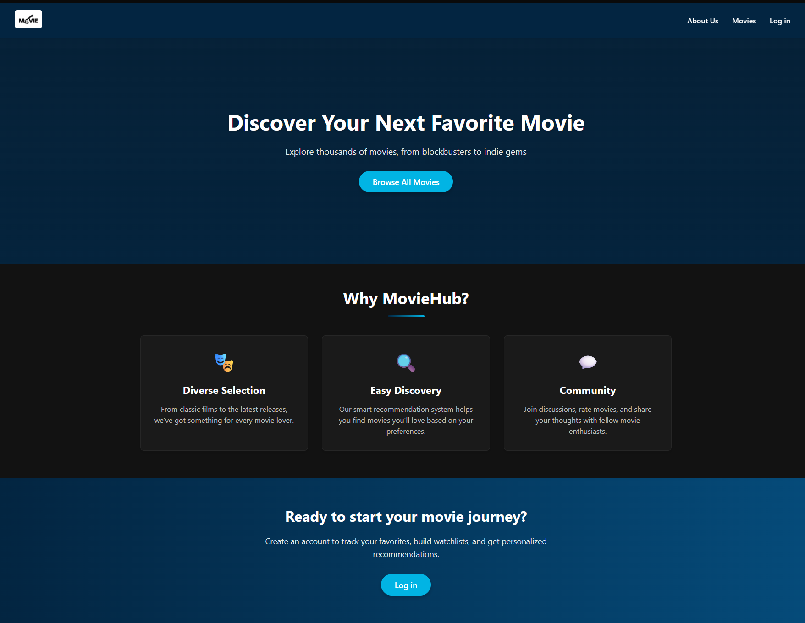
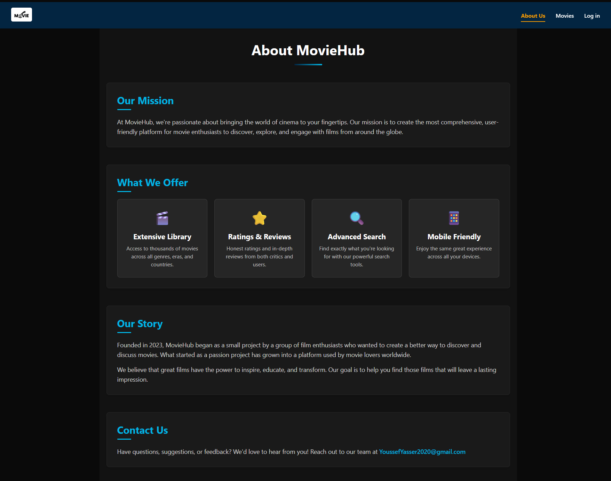
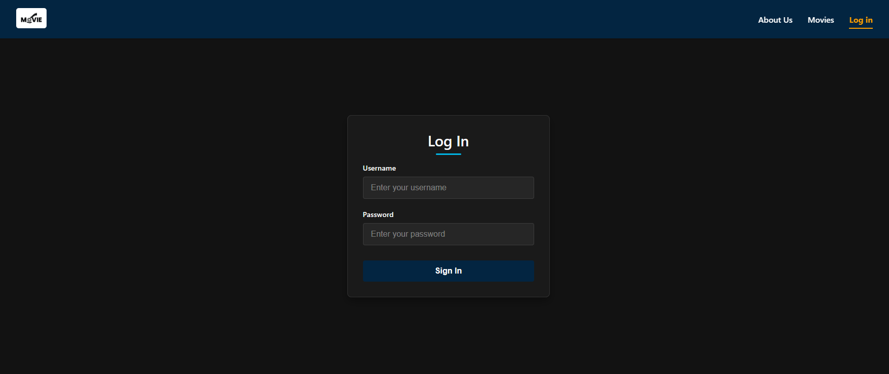

# MovieHub - React Movie Database Application

## Overview

MovieHub is a modern, responsive React application that allows users to browse and explore movies from around the world. Built with React and Vite, this application provides a seamless user experience with fast loading times and a clean, intuitive interface.

## 📸 Preview

  
  
  


## Features

### 🎬 Movie Browsing

- Popular Movies List : Browse through trending and popular movies
- Detailed Movie Pages : View comprehensive information about each movie including:
  - High-quality poster and backdrop images
  - Ratings and vote counts
  - Release dates
  - Genre tags
  - Plot overviews
  - Original language and title information

### 👤 User Authentication

- Login System : User-friendly login interface
- Session Management : Secure user session handling

### 🎨 Modern UI/UX

- Responsive Design : Fully responsive layout that works on all devices
- Dark Theme : Eye-friendly dark mode interface
- Animated Components : Subtle animations for enhanced user experience
- Intuitive Navigation : Easy-to-use navbar with mobile-friendly menu

### 🔍 Additional Pages

- Home Page : Welcoming landing page with featured content and call-to-action sections
- About Page : Information about the MovieHub platform and its features
- Movies Page : Dedicated page for browsing the movie collection

## Technical Implementation

### Architecture

- Component-Based Structure : Modular components for reusability and maintainability
- React Router : Seamless navigation between pages
- Custom Hooks : Specialized hooks like useFetch for data fetching
- Responsive CSS : Modern styling with CSS variables for theming

### API Integration

- Integration with The Movie Database (TMDB) API for fetching movie data
- Efficient data fetching with loading states and error handling

### Performance Optimizations

- Lazy loading of images and components
- Memoization of expensive calculations
- Efficient state management

## Getting Started

### Prerequisites

- Node.js (v14 or higher)
- npm or yarn

### Installation

1. Clone the repository

```bash
git clone https://github.com/yourusername/moviehub.git
cd moviehub
```

2. Install dependencies

```bash
npm install
```

3. Start the development server

```bash
npm run dev
```

4. Open your browser and navigate to http://localhost:5173

### Building for Production

```bash
npm run build
```

## Project Structure

```plaintext
├── public/              # Static assets
├── src/
│   ├── assets/          # Images and other assets
│   ├── components/      # Reusable UI components
│   ├── pages/           # Page components
│   ├── utils/           # Utility functions and hooks
│   ├── App.jsx          # Main application component
│   ├── main.jsx         # Application entry point
│   └── index.css        # Global styles
├── package.json         # Project dependencies and scripts
└── vite.config.js       # Vite configuration
```

## Future Enhancements

- User registration functionality
- Favorite movies list
- Advanced search and filtering
- User reviews and ratings
- Personalized recommendations

## Technologies Used

- React 19
- React Router
- Vite
- CSS3 with variables for theming
- The Movie Database API

## License

This project is licensed under the MIT License - see the LICENSE file for details.

## Acknowledgments

- Movie data provided by The Movie Database (TMDB)
- Icons and design inspiration from various open-source projects
